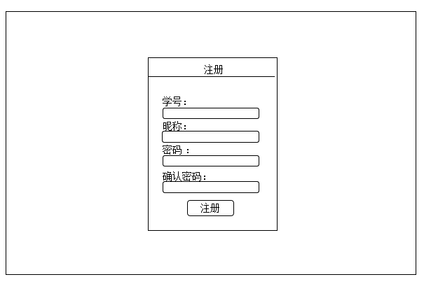
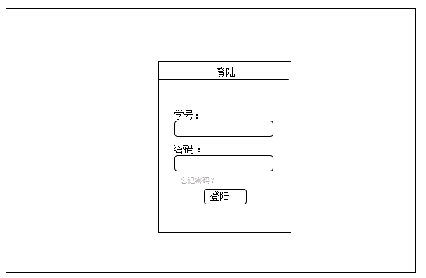
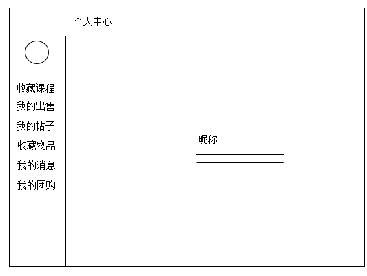
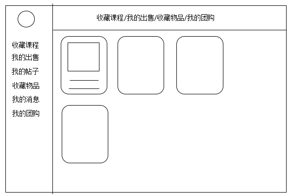
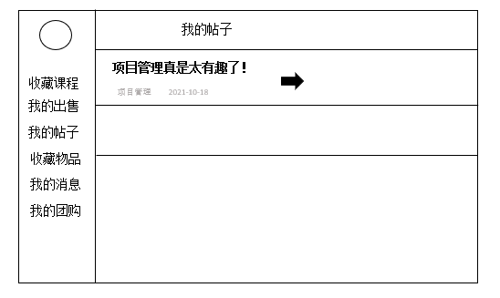
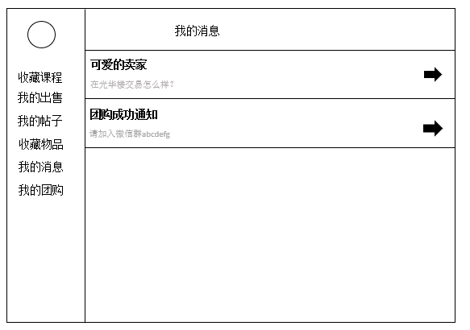
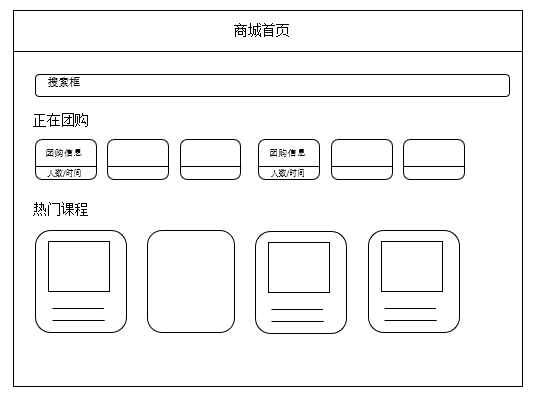
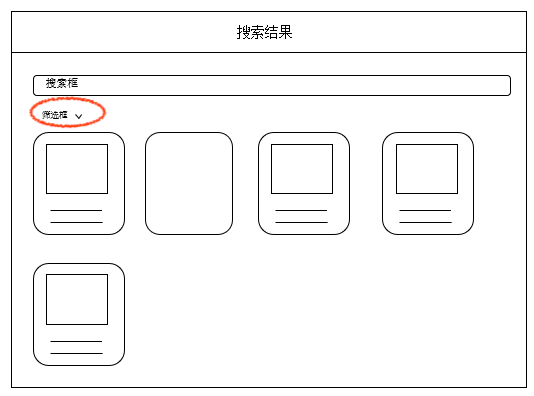
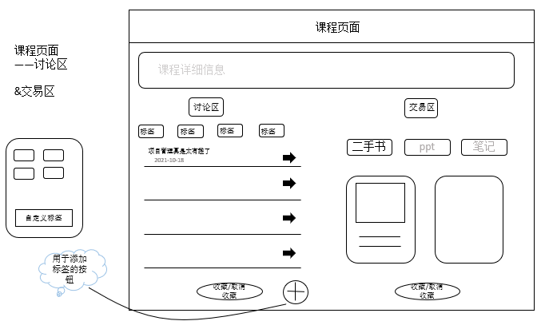

# 网页端进度安排

## 参与人员

胡彧锋、耿树筱

## 分工安排

- 胡彧锋

    1. 注册页面

       

    2. 登陆页面

       

    3. 个人中心

       

    4. 收藏课程/我的出售/收藏物品/我的团购

       

    5. 我的帖子

       

    6. 我的消息

       

- 耿树筱

   1. 商城首页

      

   2. 搜索结果页

      

   3. 课程页面

      

## 进度计划

> 选择 vue + ElementUI 构建

1. 2021.11.14 ~ 2021.11.18（4 天） ：创建基本组件

2. 2021.11.18 ~ 2021.11.21（3 天）

   - 胡彧锋：注册登陆页面
   - 耿树筱：商场首页

3. 2021.11.21 ~ 2021.11.25 （4 天）

   - 胡彧锋：个人中心、我的消息页面

   - 耿树筱：搜索结果页

4. 2021.11.25 ~ 2021.11.28 （3 天）

   - 胡彧锋：我的帖子、收藏课程/我的出售/收藏物品/我的团购页面
   - 耿树筱：课程页面

5. 2021.11.28 ~ 2021.12.02 （4 天）：完善页面样式，测试与后端通信